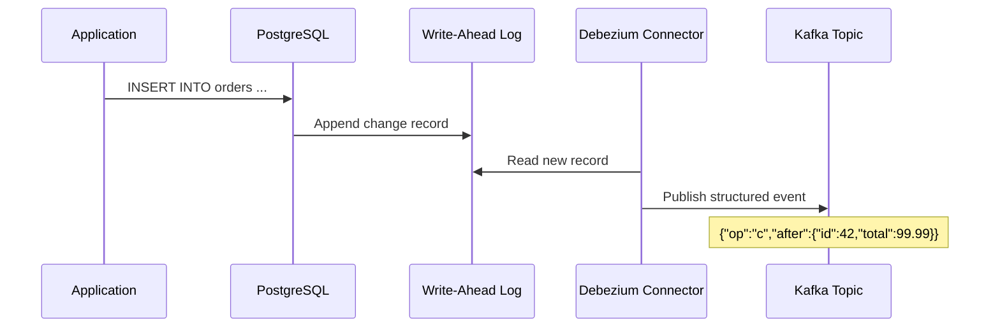

# Change Data Capture (CDC): Tracking Your Database Events

You need to sync data from PostgreSQL to Elasticsearch. Or invalidate a cache entry every time a row updates. Or stream orders to your analytics pipeline in near real-time.

The naive approach? Poll the database every 5 seconds:

```sql
SELECT * FROM orders WHERE updated_at > :last_check;
```

This works for tiny datasets. But once you hit thousands of rows per minute, polling starts falling apart—you're hammering the database with wasteful queries, missing updates between polls, and dealing with delete events you can't even detect.

CDC fixes all of that. Let me show you how.

## What CDC Actually Does

**Change Data Capture** is a pattern where your database spits out every insert, update, and delete as it happens. You don't poll. You _listen_.

```
+----------+        +----------+        +-------------+
| Postgres | -----> | CDC      | -----> | Kafka Topic |
|          |        | Connector|        | "db.orders" |
+----------+        +----------+        +-------------+
                                              |
                                     +--------+--------+
                                     |                  |
                                Elasticsearch      Cache
```

The database maintains a write-ahead log (WAL) of every change. CDC connectors read that log and publish structured events downstream.

## The Problem with Polling

Let's be real about why polling sucks:

| Aspect | Polling (❌) | CDC (✅) |
|--------|-------------|----------|
| Detection delay | Up to `poll_interval` seconds | Sub-second (real-time) |
| Database load | Constant SELECT queries on indexed columns | Zero read queries |
| Delete events | Can't detect (rows gone) | Captured in the log |
| Schema changes | Need app-level handling | Can be handled by schema registry |
| Scale cost | Linear with table size | Constant (log-based) |

Here's what polling looks like in practice:

```python
# ❌ POLLING - wasteful at scale
def poll_for_changes():
    while True:
        last_id = cache.get('last_processed_id', 0)
        results = db.execute("SELECT * FROM orders WHERE id > ?", last_id)
        for row in results:
            sync_to_elasticsearch(row)
            cache.set('last_processed_id', row['id'])
        time.sleep(5)  # 5 second delay minimum
```

With CDC, the database pushes changes to you instead. Zero wasted queries.

## How CDC Works (The Two Flavors)

### 1. Log-Based CDC (The Good Stuff)

PostgreSQL, MySQL, and most modern databases write every change to an append-only transaction log (WAL, binlog, etc.). CDC connectors read directly from that log.



**Pros:** Zero database impact, captures everything (including deletes), sub-second latency.
**Cons:** Requires the database log to be accessible, some storage overhead for log retention.

### 2. Query-Based CDC (The Pragmatic Fallback)

Some databases don't expose transaction logs (SQLite, older MySQL versions without binlog). In those cases, you fall back to tracking changes via `updated_at`, version columns, or trigger tables.

```sql
-- ✅ QUERY-BASED CDC using tracking columns
CREATE TABLE orders_audit (
    audit_id SERIAL PRIMARY KEY,
    order_id INT NOT NULL,
    operation TEXT NOT NULL, -- 'INSERT', 'UPDATE', 'DELETE'
    changed_at TIMESTAMP DEFAULT CURRENT_TIMESTAMP,
    data JSONB
);

-- Requires triggers: INSERT/UPDATE/DELETE on orders
```

This is better than raw polling but requires trigger overhead and eats storage.

## The Debezium Way (Production CDC)

[Debezium](https://debezium.io/) is the gold standard for CDC. It wraps database log reading into Kafka Connect connectors that emit structured events.

```json
// Debezium CDC event for an order UPDATE
{
  "schema": { /* ... schema registry ... */ },
  "payload": {
    "op": "u",                        // Operation: c=create, u=update, d=delete, r=read
    "ts_ms": 1716591234000,           // Timestamp in the database
    "before": {                       // Previous state (before update)
      "id": 42,
      "status": "pending",
      "total": 99.99
    },
    "after": {                        // Current state (after update)
      "id": 42,
      "status": "shipped",
      "total": 99.99
    },
    "source": {
      "db": "ecommerce",
      "table": "orders",
      "lsn": 29384756                 // Log Sequence Number - for dedup
    }
  }
}
```

Here's the minimal setup for Debezium + PostgreSQL:

```yaml
# docker-compose.yml - Debezium with Postgres and Kafka
version: '3'
services:
  postgres:
    image: debezium/example-postgres:latest
    environment:
      POSTGRES_DB: ecommerce
    ports:
      - "5432:5432"

  kafka:
    image: confluentinc/cp-kafka:latest
    environment:
      KAFKA_ADVERTISED_LISTENERS: PLAINTEXT://localhost:9092

  debezium:
    image: debezium/connect:latest
    ports:
      - "8083:8083"
    environment:
      BOOTSTRAP_SERVERS: kafka:9092
      GROUP_ID: 1
      CONFIG_STORAGE_TOPIC: connect-configs
      OFFSET_STORAGE_TOPIC: connect-offsets
```

Then register a connector:

```bash
# Register a PostgreSQL CDC connector with Debezium
curl -X POST http://localhost:8083/connectors \
  -H "Content-Type: application/json" \
  -d '{
    "name": "orders-connector",
    "config": {
      "connector.class": "io.debezium.connector.postgresql.PostgresConnector",
      "database.hostname": "postgres",
      "database.port": "5432",
      "database.user": "debezium",
      "database.password": "dbz",
      "database.dbname": "ecommerce",
      "database.server.name": "pg-ecommerce",
      "table.include.list": "public.orders",
      "plugin.name": "pgoutput"
    }
  }'
```

Once the connector runs, every change to `orders` appears as an event in Kafka topic `pg-ecommerce.public.orders`.

## But CDC Isn't Free

I'd be lying if I said CDC was all sunshine. Here's the real trade-off:

**Storage:** The WAL grows. You need enough retention to let consumers catch up if they go offline.

**Schema changes:** Adding a column? The CDC events start including the new field. Downstream consumers need to handle schema evolution. This is why you want a **schema registry** (Avro, Protobuf, or JSON Schema).

**At-least-once delivery:** Most CDC connectors deliver events at least once, which means duplicates are possible. Your consumers need to be idempotent:

```python
# ✅ IDEMPOTENT CONSUMER - handles CDC duplicates
def process_order_event(event):
    # Check if we've already processed this LSN (Log Sequence Number)
    lsn = event['source']['lsn']
    if redis.exists(f"processed:lsn:{lsn}"):
        return  # Already handled this change
    
    order_id = event['after']['id']
    sync_order_to_search(order_id)
    
    # Track LSN to avoid reprocessing
    redis.set(f"processed:lsn:{lsn}", "1", ex=86400)  # 24h TTL
```

**Initial snapshot:** When you first connect CDC to an existing table, it takes a snapshot of current data. That snapshot event stream is large and can impact performance if not throttled.

## When to Use CDC (vs When Not To)

### CDC Shines For:

- **Indexing/search sync** — Database → Elasticsearch/Meilisearch
- **Cache invalidation** — Immediate cache eviction when data changes
- **Data warehousing** — Streaming database changes into a data lake
- **Audit logging** — Complete change history without application code
- **Microservices** — Publishing domain events from services that own data

### CDC Is Overkill For:

- **Simple counts or aggregations** — Just query occasionally
- **Small datasets (< 1000 rows)** — Polling is fine
- **Batch processing (hourly reports)** — CDC adds complexity you don't need
- **Temporary migrations** — Script it and don't over-engineer

## Key Takeaways

- **Polling breaks at scale** — CDC reads the database transaction log, not the data
- **Log-based CDC is the real deal** — Debezium + Kafka covers 90% of use cases
- **Consumers must be idempotent** — CDC delivers at-least-once, not exactly-once
- **Storage and schema evolution are the hidden costs** — plan for WAL retention and use a schema registry
- **Start simple** — If you're moving <100 rows/minute, polling is fine. If you're building a real-time sync pipeline, CDC is the standard.

CDC transforms your database from a passive data store into an event source. It's one of those patterns where, once you set it up, you wonder how you lived without it.
